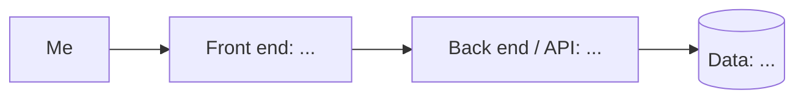

<!--
  Product 1 Spec Template
  Copy everything in this file into the README.md of your Product 1 repo.
  Walkthrough, examples, and AI prompts are in the guide:
  https://github.com/464squad/IEL/blob/main/projects/product-1/product-spec-guide.md
  Delete these instructions and the italic hints as you fill each section in.
-->

# [Product Name]

> One line: what this is and who it's for (hint: it's for you).

**Author:** [Your name] · **Course:** CMP 464/343 Product 1 · **Last updated:** [date]

---

## 1. About Me (the User)

*Who am I in the context of this problem? What roles am I playing (student, employee, parent, athlete, gamer…)?*

[Your answer]

**The last 3 times this happened:**
*Real, recent moments. For each: when and where, what went wrong, what it cost, what you did.*

1. 
2. 
3. 

**What it costs me:**
*Be specific. How often, how much?*

- ⏱️ Time:
- 💸 Money:
- 🔋 Energy:
- 🙂 Joy:

---

## 2. Problem Statement

**Gut check:**

> I need **[X]** because **[Y]**.

**Five Whys:**
1. Why?
2. Why?
3. Why?
4. Why?
5. Why?

**Problem statement:**

> **When** [a specific moment that keeps happening],
> **I struggle to** [what goes wrong],
> **which costs me** [time / money / energy / joy, with numbers if you can].
> **This happens because** [root cause].
> **Right now I** [what I do today], **but** [why it falls short].

**I'll know this is solved when:** [something I could observe changing]

*Check: none of these words appear: app, website, platform, dashboard, tool, AI, track, automate, notify, feature.*

---

## 3. Existing Solutions

| What I use or tried | What it does well | Why it falls short *for me* |
|---|---|---|
| | | |
| | | |
| | | |

**The gap:** *In one sentence, what's still missing for me?*

[Your answer]

---

## 4. Features & Benefits

*Every feature should move me toward my "solved when" line.*

| Feature (what it does) | Benefit (how my life gets better) | MVP or Later? |
|---|---|---|
| | | |
| | | |
| | | |
| | | |

**MVP (2–3 features):** *The skateboard: the smallest version I'd actually use.*
- 
- 

**Later:**
- 

**Not doing:** *Things I'm deliberately leaving out.*
- 

---

## 5. Tech Stack

### Front end
- **Surface:** [CLI / Web / Mobile / Cross-platform / Chat]
- **Tools:** [e.g., Next.js, Python, Expo]
- **Why:** *How does this fit where and when I have the problem?*

### Back end
| Piece | Choice | Why |
|---|---|---|
| Server / API | | |
| Data storage | | |
| Outside services (optional) | | |
| Hosting / deploy | | |

### Architecture sketch

---

## 6. Open Questions

*What am I still unsure about? What do I need to figure out or test first?*

- 
