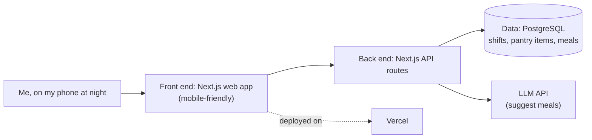

# Product 1: Write Your First Product Spec

> **In-class exercise · ~90 minutes**
> By the end of class you'll have a first draft of a product spec for **Product 1: a product for yourself**, written in the `README.md` of your Product 1 repo.

Product 1 is built for **you**. You are the user and the stakeholder. As we said in class: *"The stakeholder? It's your life."* So this spec isn't about finding a market or pitching an investor. It's about looking honestly at your own routines, frustrations and goals, then writing them down clearly enough that you (and an AI agent) can build something that actually helps.

**Why a spec?** A spec lists what you're building, why, and what's in or out. Clear requirements are close to a prerequisite for working well with AI. The more clearly you can say "here's what I need, here's what this is, here's what I don't want," the better every agent, chat and teammate can help you.

---

## How to use this guide

1. **Make a copy of the template.** Open [`SPEC_TEMPLATE.md`](./SPEC_TEMPLATE.md), copy all of it, and paste it into the `README.md` of your Product 1 repo. Your README *is* your spec.
2. **Work through the sections in order.** Each one has:
   - 📖 **Learn**: what the section is for and what "good" looks like
   - 🪞 **Reflect**: questions to ask *yourself*
   - ✍️ **Write**: what to fill in on your template
   - 🤖 **Ask an agent**: prompts you can paste into Claude, ChatGPT, Gemini, Copilot, or Cursor
   - ✅ **Check**: a quick self-check before you move on
3. **Keep one AI chat thread for the whole exercise.** That thread becomes useful context later when you plan and build.

### Timing (90 minutes)

| Time | Section |
|------|---------|
| 0:00–0:05 | [Before you start](#before-you-start-5-min) |
| 0:05–0:25 | [1. Understand the user (that's you)](#1-understand-the-user-thats-you-20-min) |
| 0:25–0:40 | [2. Write the problem statement](#2-write-the-problem-statement-15-min) |
| 0:40–0:52 | [3. Look at existing solutions](#3-look-at-existing-solutions-12-min) |
| 0:52–1:07 | [4. Features vs. benefits & your MVP](#4-features-vs-benefits--your-mvp-15-min) |
| 1:07–1:22 | [5. Tech stack: front end & back end](#5-tech-stack-front-end--back-end-15-min) |
| 1:22–1:30 | [Wrap up & share out](#wrap-up--share-out-8-min) |

---

## Before you start (5 min)

### Ground rules for using AI in this exercise

AI is your **thinking partner**, not your ghostwriter. Your spec should sound like you and be about your life.

- ✅ **Do** ask the AI to *interview* you, ask you questions, poke holes in your draft, and explain concepts.
- ✅ **Do** give it context: your notes, your draft, or even the class transcript ("here's what I said about my project in class…").
- ❌ **Don't** ask it to "write my spec" or "give me a project idea." If the AI came up with your problem, it isn't your problem.
- ❌ **Don't** paste in anything you wouldn't want stored (passwords, other people's private info).
- 🧠 **You write the final words** in your README. You can borrow phrasing that fits, but read every line and make sure it's true for you.

A basic chat model (free ChatGPT, Gemini, Claude, etc.) is enough for today. You don't need an agent, because you're only asking it to talk with you.

### 🤖 Starter prompt: set up your thread

Paste this first so the AI knows its role for the rest of the session:

```text
I'm a computer science student writing a product spec for a small software
product I'll build for MYSELF, to solve a problem in my own life. I'm going to
work through these sections with you: (1) understanding myself as the user,
(2) a problem statement, (3) existing solutions, (4) features vs. benefits and
an MVP, and (5) my tech stack (front end and back end).

Your role: be a thoughtful interviewer and coach. Ask me questions one or two
at a time. Push me to be specific and honest. Do NOT invent a problem or
solution for me, and do NOT write my spec for me. When I share a draft, tell me
what's clear, what's vague, and what question I should answer next.
Reply "ready" when you understand.
```

---

## 1. Understand the user (that's you) (20 min)

### 📖 Learn

Every good product starts with **empathy**: understanding the person who has the problem *before* deciding what to build. In discovery we usually interview other people. For Product 1, **turn the interview inward**. You're the person in the middle of the user interview grid.

Look at your day-to-day and week-to-week: school, work, family, commute, community, hobbies, health, money. Look for something that keeps costing you:

- ⏱️ **Time lost**
- 💸 **Money lost**
- 🔋 **Energy lost**
- 🙂 **Joy lost**

Stay on the **problem**, not the solution. If you catch yourself thinking "I'll build an app that…", stop and ask, "What's actually happening in my life that makes me want that?"

> **Pick something that's really yours.** A generic "student planner" or a Jira clone is the easy default. A good Product 1 is specific to how *you* live and work, and it gives you a story you can tell in an interview: "I had this problem, so I built this."

### 🪞 Reflect: your self-interview grid

Spend real time here. Journal, bullet-point, or talk it out. Nobody else needs to see this part.

| Grid | Ask yourself |
|------|--------------|
| **Saying & hearing** | What have I been complaining about lately? What do people around me keep saying to me ("you're always late," "did you forget again?")? |
| **Thinking** | What's on my mind when I'm stressed? What do I wish I could stop thinking about? |
| **Feeling** | When during the week do I feel frustrated, anxious, overwhelmed, or bored? What sets it off? |
| **Doing (routines)** | Walk through a normal weekday and weekend. Where do I repeat the same annoying steps? What do I put off? |
| **Environment** | Where am I when it happens (train, job, kitchen, library, gym, phone at midnight)? What tools or devices do I have in that moment? |
| **Pains** | What costs me time, money, energy, or joy? Roughly how much, and how often? |
| **Goals** | What am I trying to get better at or reach (grades, fitness, a job, saving money, a skill, family)? What's in the way? |

Circle the one or two pains that show up the most, or that bother you the most.

### ✍️ Write

In your template, fill in **1. About Me (the User)**:
- Who you are in the context of this problem (your roles, like student, employee, parent, athlete, gamer, caregiver)
- A short "day in the life" moment when the problem shows up
- What it costs you (time, money, energy, joy), as specifically as you can

### 🤖 Ask an agent

**Explain it:**
```text
Explain what "empathy" and "discovery" mean in human-centered product design,
and why a product team studies the user before choosing a solution. Then
explain how I could run a user interview on MYSELF. Keep it short and give one
example.
```

**Interview me:**
```text
Interview me to help me find a problem in my own life worth building software
for. Use the user interview grid (what I'm saying/hearing, thinking, feeling,
doing, my environment, my pains, my goals). Ask me 1–2 questions at a time,
and ask follow-ups when my answers are vague. Focus on where I'm losing time,
money, energy, or joy. Don't suggest any solutions or app ideas. After about
8–10 questions, summarize the 2–3 strongest pain points you heard, in my own
words.
```

**Already have an idea? Check it:**
```text
Here's a problem I'm thinking about solving for myself: [describe it].
Ask me questions to check whether this is a real, recurring problem in MY life
or just an idea that sounds cool. Help me describe when it happens, how often,
and what it costs me. Don't propose solutions.
```

### ✅ Check
- [ ] I can describe a specific moment in my week when this problem happens.
- [ ] I can say what it costs me (time, money, energy, or joy).
- [ ] I haven't described a solution yet.

---

## 2. Write the problem statement (15 min)

### 📖 Learn

A **problem statement** says **who** needs **what** and **why**, without naming the solution. For a personal product, use this format:

> **I need `[X]` because `[Y]`.**

- **X** is the need, meaning what you're missing or can't do easily. It is *not* a feature or an app.
- **Y** is the underlying experience: why it matters and what happens when the need isn't met.

**Go deeper with the Five Whys.** Once you have a first draft, ask yourself *"why?"* up to five times. Each answer gets you closer to the **root cause** instead of the surface symptom.

#### Example: from weak to strong

> ❌ **Weak:** "I need a meal-planning app."
> *(That's a solution, not a problem.)*

> ❌ **Still weak:** "I need to eat better."
> *(Too vague. It doesn't say why or when.)*

**Five Whys on "I keep buying lunch out":**
1. *Why?* I don't have food with me on days I work after class.
2. *Why?* I don't prep anything the night before.
3. *Why?* By the time I get home I'm tired and don't know what I have in the fridge.
4. *Why?* My shift schedule changes every week, so no routine sticks.
5. *Why does that matter?* I'm spending around $50 a week I don't have, and I feel drained on long days.

> ✅ **Strong:** "I need a quick way to plan food around my changing work shifts **because** on long class-plus-work days I end up spending about $50 a week on takeout and running out of energy by the evening."

Notice what the strong version does: it's specific and personal, it states a real cost, and it still doesn't say "app," "website," or any feature.

### ✍️ Write

In your template, fill in **2. Problem Statement**:
- Your Five Whys chain (keep it, because it shows your thinking)
- Your final **"I need X because Y"** sentence

### 🤖 Ask an agent

**Your class prompt:**
```text
I'm building a new product for myself and want to write a clear problem
statement. Here's what I'm thinking so far: [insert your draft or thoughts].
Interview me and help me make it a stronger statement, articulating the
problem without being focused on the solution.
```

**Run the Five Whys with me:**
```text
Here's a problem I experience: [one sentence]. Walk me through the Five Whys.
Ask me "why?" one question at a time and wait for my answer each time. At the
end, reflect back what the root cause seems to be, and point out if my answers
drifted toward a solution instead of the problem.
```

**Check my statement:**
```text
Critique this personal problem statement: "I need [X] because [Y]."
Check: (1) Is X a need rather than a solution or feature? (2) Does Y explain a
real experience or cost? (3) Is it specific enough that someone could tell
whether a product solved it? Don't rewrite it for me. Ask me the questions
I'd need to answer to improve it.
```

### ✅ Check
- [ ] My statement follows "I need X because Y."
- [ ] It doesn't name an app, website, or feature.
- [ ] It includes a real cost or consequence in my life.
- [ ] If I read it a month from now, I'd still know exactly what I meant.

---

## 3. Look at existing solutions (12 min)

### 📖 Learn

Your problem almost certainly isn't brand new, and that's fine. Zoom didn't invent video calls. WebEx and Skype already existed. Zoom won by giving a **better experience** to people who were unhappy with what was there.

Your job here is to be honest about:
1. **What you already do** to deal with this problem: apps, spreadsheets, notes, group chats, asking someone, a workaround, or just putting up with it.
2. **What else is out there**: tools other people use for this.
3. **Why none of it works for *you***. What about your situation, habits, or constraints makes these fall short?

Keep it introspective. The key question isn't "is this app popular?" It's "**why haven't I stuck with it, and what would I need to be different?**"

### 🪞 Reflect
- What do I do *today* when this problem shows up?
- What have I tried before and quit? Why did I quit?
- What's annoying, missing, too slow, too expensive, or "not built for someone like me" about the options I know?
- If one of these tools worked perfectly for me, would my problem be solved? If yes, maybe I just need to use it. If no, what's the gap?

### ✍️ Write

In your template, fill in **3. Existing Solutions** with 2–4 rows:

| What I use or tried | What it does well | Why it falls short *for me* |
|---|---|---|
| *Notes app list* | *Always on my phone* | *I forget to update it; it doesn't know my shift schedule* |
| *Popular meal-planning app* | *Lots of recipes* | *Assumes I cook every night; too many steps when I'm tired* |

Then write one sentence on **the gap**: what's still missing for you.

### 🤖 Ask an agent

**Map what exists:**
```text
My problem statement is: "I need [X] because [Y]." What kinds of existing tools,
apps, or everyday workarounds do people commonly use for this kind of problem?
Give me a short list by category, not a sales pitch. Then ask me which ones
I've tried and why they didn't stick.
```

**Find my gap:**
```text
Here's what I currently do or have tried for my problem: [list]. Interview me
about why each one falls short for ME specifically: my schedule, habits,
budget, devices, and what I care about. Then summarize the gap that none of
them fill. Don't design a product yet.
```

### ✅ Check
- [ ] I listed what *I* actually do today, even if it's "nothing" or "I just deal with it."
- [ ] For each option, I explained why it doesn't work *for me*.
- [ ] I can say in one sentence what's still missing.

---

## 4. Features vs. benefits & your MVP (15 min)

### 📖 Learn

Now you can start thinking about solutions, while keeping them tied to your problem.

- A **feature** is something the product **does** or **has**. ("Sends a reminder at 9pm.")
- A **benefit** is how **your life gets better** because of it. ("I don't wake up with nothing packed for a long day.")

Features are for building. Benefits are the reason to build. **Every feature should trace back to a benefit, and every benefit should trace back to your problem statement.** If a feature has no benefit tied to your problem, cut it.

| ❌ Feature with no clear benefit | ✅ Feature → Benefit |
|---|---|
| "Has a dark mode" | "Pulls in my weekly shift schedule → I don't have to re-enter my week every Sunday" |
| "Uses AI" | "Suggests 2 meals from what I already have → I spend less money and less brainpower at 10pm" |

**Your MVP (minimum viable product)** is the *smallest* set of features that meaningfully helps with your problem, small enough to build, use, and learn from quickly.

> Think **skateboard, not car**. With a waterfall approach, you'd build a wheel, then an axle, then a body, and have nothing usable until the very end. With an agile approach, you first build a skateboard, then a scooter, then a bike, then a car. Each version is something you can actually use and get feedback on. Your MVP is the skateboard.

### 🪞 Reflect
- If this product only did **one** thing, which one thing would help me most?
- Which features am I excited about just because they're cool, not because they solve my problem?
- What would I actually use this week, on a bad day, when I'm tired?

### ✍️ Write

In your template, fill in **4. Features & Benefits**:
- A table of features → benefits (aim for 4–6 ideas)
- Mark 2–3 as **MVP**. The rest go under **Later**.
- A **Not doing** list: things you're deliberately leaving out (this is part of a good spec too)

### 🤖 Ask an agent

**Explain it:**
```text
Explain the difference between a feature and a benefit in product design, and
what an MVP is. Use the "skateboard vs. car" idea from agile. Keep it short and
give one non-software example.
```

**Pressure-test my features:**
```text
My problem statement: "I need [X] because [Y]."
Here are the features I'm considering: [list].
For each one, ask me what benefit it gives ME and how it connects to my
problem. Flag any feature that doesn't clearly connect. Then ask me questions
to help me choose the 2–3 that belong in my MVP. Don't add new features
unless I ask.
```

**Shrink my MVP:**
```text
Here's my MVP feature list: [list]. I have about 4 weeks to build this as a
student. Help me find the smallest version that would still help with my
problem. Ask me what I'd give up first and why.
```

### ✅ Check
- [ ] Every feature in my table has a benefit written in terms of *my* life.
- [ ] My MVP is 2–3 features, and I could picture using it this week.
- [ ] I have a "Not doing" list.

---

## 5. Tech stack: front end & back end (15 min)

### 📖 Learn

Remember the architecture spine: **client → API → data → deploy**. Your tech stack is the set of tools you'll use for each part. There's no single right answer. The goal is to **choose on purpose and explain why**.

#### Front end: the *surface* (where you use it)

Your self-interview already hints at this. **Where are you when the problem happens?**

| Surface | Good fit when… | Example tools |
|---|---|---|
| **CLI** (command line) | You're at a computer, want something fast and simple, or want the quickest MVP | Node.js, Python |
| **Web** | You want it on any device with a browser, laptop or phone | Next.js (our shared example stack), React |
| **Mobile** | The problem happens on the go and needs your phone (notifications, camera, location) | React Native / Expo, Swift, Kotlin |
| **Cross-platform** | You need the same app on phone and desktop | Expo, Flutter |
| **Chat / LLM** | The most natural way to use it is by talking or typing to it | A chat UI or an assistant with tool connections (MCP-style) |

#### Back end: what happens behind the surface

| Piece | The question it answers | Example options |
|---|---|---|
| **Server / API** | What logic runs, and how does the front end ask for data? | Next.js API routes, Express, FastAPI |
| **Data** | What do I need to save, and where? | A JSON file or SQLite (simplest), PostgreSQL (e.g., Supabase), MongoDB |
| **Outside services** *(optional)* | Do I need anything from outside, like AI, calendars, or auth? | An LLM API, Google Calendar API, an auth provider |
| **Hosting / deploy** | Where does it run so I can actually use it? | Your own machine (CLI), Vercel, Render |

> **Keep your MVP stack as simple as your MVP.** A CLI that saves to a local file is a completely valid Product 1 skateboard. You can grow into web or mobile later with the same architecture and a different client.

#### Example architecture (for the meal-planning example)



GitHub renders this diagram automatically. You can also draw yours on paper or in Excalidraw and add a photo to your repo.

### 🪞 Reflect
- Where am I, and what device am I holding, when this problem shows up?
- What does my MVP need to **remember** between uses? (That's your data.)
- What am I comfortable building in right now, and what do I want to learn this semester?
- What's the simplest stack that still gets my MVP working?

### ✍️ Write

In your template, fill in **5. Tech Stack**:
- **Front end:** surface + tools, and *why* (tie it to where and when you have the problem)
- **Back end:** server/API, data, any outside services, hosting, each with a one-line *why*
- A simple **architecture sketch** (use the Mermaid example above as a starting point, or a photo)

### 🤖 Ask an agent

**Explain the pieces:**
```text
Explain the parts of a full stack app (front end/client, back end/API, database,
and hosting) using a simple everyday analogy. Then explain how the same back end
could serve different front ends (a CLI, a web app, a mobile app). Keep it
beginner-friendly.
```

**Help me choose (don't choose for me):**
```text
I'm a student building a personal product. My problem statement: "I need [X]
because [Y]." My MVP features: [list]. I usually experience this problem
[where/when/on what device]. I'm comfortable with [languages/tools] and want to
learn [anything].

Ask me questions to help me choose a front end surface (CLI, web, mobile,
cross-platform, or chat) and a simple back end (API, data storage, hosting).
Then lay out 2 reasonable stack options with tradeoffs for a 4-week student
project. Let me pick. Don't pick for me.
```

**Sketch my architecture:**
```text
Here's my stack: front end [ ], back end/API [ ], data [ ], outside services [ ],
hosting [ ]. Write a simple Mermaid flowchart showing how a request flows from
me (the user) through the front end, API, and data. Then explain each arrow in
one sentence so I can check that I understand it.
```

### ✅ Check
- [ ] I picked a front end surface and can explain why it fits *where I have the problem*.
- [ ] I named my back end pieces (API, data, hosting) and why.
- [ ] I have an architecture sketch, and I can explain every arrow without AI.
- [ ] My stack is only as big as my MVP needs.

---

## Wrap up & share out (8 min)

1. **Read your spec top to bottom.** Does each section connect to the one before it?
   *Me → my problem → what exists → what I'll build first → how I'll build it.*
2. **Run the final check prompt:**
   ```text
   Here's my full product spec draft: [paste your README]. Act as a reviewer.
   Check that (1) the problem statement doesn't describe a solution, (2) every
   MVP feature connects to a benefit tied to the problem, (3) the tech stack
   choices have reasons, and (4) the spec is specific enough to start building.
   List what's strong, what's unclear, and the top 3 questions I should answer
   next. Don't rewrite it.
   ```
3. **Commit and push** your README to your Product 1 repo.
4. **Share out:** post your **"I need X because Y"** statement in the class chat or Slack.

### Done looks like
- [ ] `README.md` in my Product 1 repo has all 5 sections filled in (drafts are fine)
- [ ] My problem statement is personal, specific, and solution-free
- [ ] My MVP is small and every feature traces back to a benefit
- [ ] My stack has a front end, a back end, and a reason for each
- [ ] Committed and pushed

> This is a **first draft**. Specs are living documents, the same way agile is iterative. You'll revise this as you build, test, and learn. Save your AI chat thread, because it's useful context when we start planning and building.

---

### Revisit the class sessions
- [Product Discovery & Project Scoping (Mon, Sep 14)](https://app.read.ai/analytics/meetings/01M2GYZSH721CJVXA8J06ZTSAN?utm_source=Share_CopyLink): discovery, problem–solution fit, interviewing yourself
- [Human-Centered Project Design (Wed, Sep 16)](https://app.read.ai/analytics/meetings/01M2P44MCJTREVZ9WAX6CCJJR7?utm_source=Share_CopyLink): user interview grid, "I need X because Y," Five Whys, MVPs, agile

**Tip:** You can give the AI a class transcript as context: "Here's what I said about my project in class. Interview me to help turn it into a problem statement."
