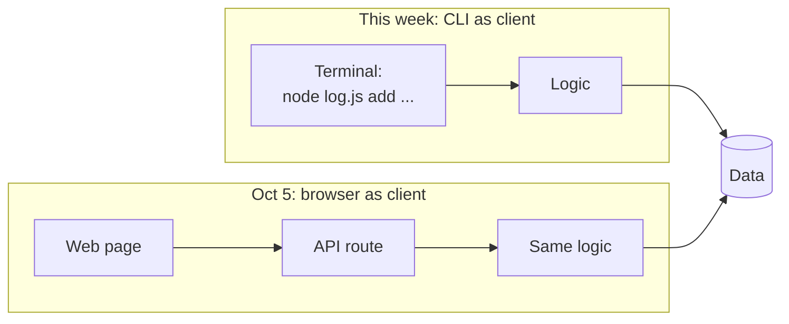

# CLI as Client: Same Architecture, Different Surface

> **Async · ~30–45 minutes · Due before class Mon, Oct 5**
> Watch the video, read this page, and (optionally) try the exercise. On Oct 5 we'll build on this with the browser as the client.

🎥 **Video:** CLI as Client (Loom, 10–15 min): *link coming soon*

---

## The big idea

Remember the architecture spine: **client → API/logic → data → deploy**.

The **client** is just the surface a user touches to use the product. This semester you'll see several clients: CLI, web, mobile, and chat. The key point is that **the rest of the architecture barely changes when the client does.** The logic and the data stay the same. Only the way you interact with them changes.

This week the client is the **command line**: you type a command, the program runs your logic, reads or writes data, and prints a result.



## Why start with a CLI?

- **Fastest path to a working skateboard.** No screens, buttons, or styling. You can go straight to the part that solves your problem.
- **Proves your logic works.** If your MVP's core action works in a terminal, putting a web or mobile front end on it later is mostly new UI, not new thinking.
- **It's a real surface.** Developers use CLIs every day (`git`, `npm`, `node`), and plenty of real products ship one.
- **Easy to test.** Run a command, check the output. That's a good start on the testing and eval mindset.

**When a CLI is *not* the right final client:** when you need the product on your phone, away from your computer, or when the problem really needs visuals, notifications, or a camera. Even then, a CLI can still be a great **first version** of your logic.

> 💡 Check your spec: in your **full problem statement**, *when* and *where* does your problem happen? If you're at a computer, a CLI might be your whole MVP. If not, it may be your first step.

---

## A tiny CLI, piece by piece

Here's a complete CLI in plain Node.js with no packages to install. It saves notes to a local file and lists them back. Look for the three layers: **client**, **logic**, and **data**.

```js
#!/usr/bin/env node
// log.js — a tiny CLI that saves notes to a local JSON file.
const fs = require("fs");

const DATA_FILE = "data.json";

// --- Data: read and write our "database" (a JSON file) ---
function load() {
  if (!fs.existsSync(DATA_FILE)) return [];
  return JSON.parse(fs.readFileSync(DATA_FILE, "utf8"));
}

function save(entries) {
  fs.writeFileSync(DATA_FILE, JSON.stringify(entries, null, 2));
}

// --- Logic: what the product actually does ---
function addEntry(text) {
  const entries = load();
  entries.push({ text, date: new Date().toISOString().slice(0, 10) });
  save(entries);
}

function listEntries() {
  return load();
}

// --- Client: the command line is how the user talks to the logic ---
const [command, ...rest] = process.argv.slice(2);

if (command === "add") {
  addEntry(rest.join(" "));
  console.log("Saved.");
} else if (command === "list") {
  for (const e of listEntries()) console.log(`${e.date}  ${e.text}`);
} else {
  console.log('Usage: node log.js add "your note"  |  node log.js list');
}
```

Try it (requires [Node.js](https://nodejs.org/) 18+):

```bash
node log.js add "Bought lunch out again, $12"
node log.js add "Prepped food Sunday"
node log.js list
```

```text
2026-09-28  Bought lunch out again, $12
2026-09-28  Prepped food Sunday
```

**What to notice:**
- **Client:** `process.argv` is how the terminal passes your command in, and `console.log` is how results come back out. That's the whole "UI."
- **Logic:** `addEntry` and `listEntries` don't know or care that a terminal is calling them. On Oct 5, a web API route could call the *same* functions.
- **Data:** `data.json` is a perfectly good database for an MVP. You can move to SQLite or PostgreSQL later without changing your logic much.

---

## Optional exercise: your MVP's core action as a CLI (~20 min)

1. Open your spec and pick your **single most important MVP feature**, the one that gets you closest to your "I'll know this is solved when…" line.
2. Write a CLI that does just that one thing, with one or two commands. Use the example above as a starting point, in Node or Python.
3. Save the data in a local JSON file.
4. Run it a few times with real examples from your life.
5. Commit it to your Product 1 repo on a branch and open a PR, even if it's rough. We practice PRs and code review in class.

It doesn't need to be pretty or complete. If it runs and does one useful thing, it's a skateboard.

---

## 🤖 Prompts

**Explain it:**
```text
Explain what a command-line interface (CLI) is and how it acts as the
"client" in a client → logic → data architecture. Then explain how the same
logic and data could later be used by a web app instead. Keep it
beginner-friendly and use one everyday analogy.
```

**Help me decide if a CLI fits my MVP:**
```text
Here's my problem statement and MVP from my product spec: [paste them].
Ask me questions to figure out whether a CLI makes sense as my first client,
my final client, or not at all. Consider where and when I experience the
problem. Don't write any code yet.
```

**Walk me through building it (I write the code):**
```text
I want to build a tiny CLI in [Node.js / Python] for this one MVP feature:
[describe it]. Data should be saved in a local JSON file. Break it into small
steps and explain each one. Let me write the code myself and review what I
write. Only show me code when I'm stuck and ask for it.
```

**Review my CLI:**
```text
Here's my CLI code: [paste it]. Review it like a teammate in a code review.
Point out bugs, confusing parts, and where the client, logic, and data are
mixed together. Suggest how I could separate them so a web front end could
reuse the logic later. Explain why for each suggestion.
```

---

## Before Oct 5
- [ ] Watched the video
- [ ] I can explain in one sentence what "same architecture, different client" means
- [ ] I checked whether a CLI fits my MVP (first version, final version, or neither)
- [ ] *(Optional)* I built a CLI for my MVP's core action and opened a PR
